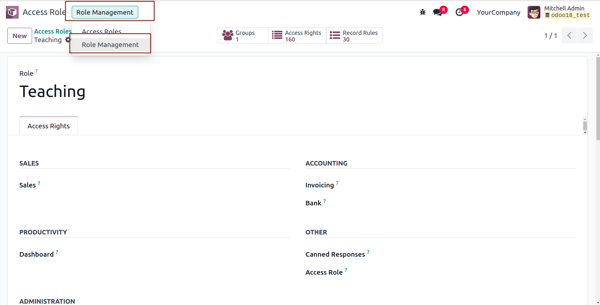
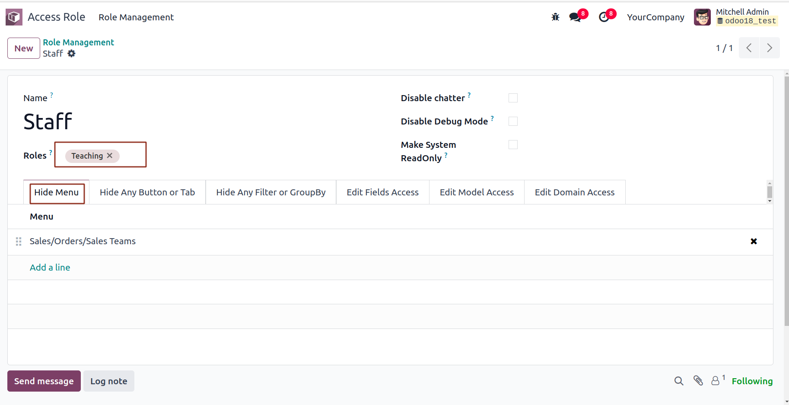
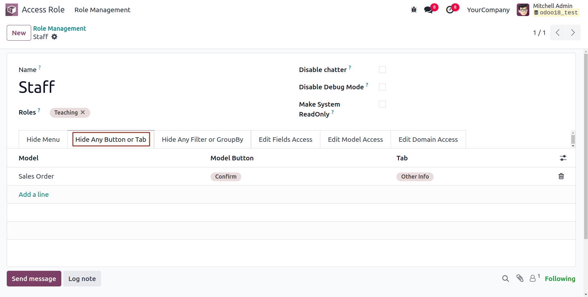
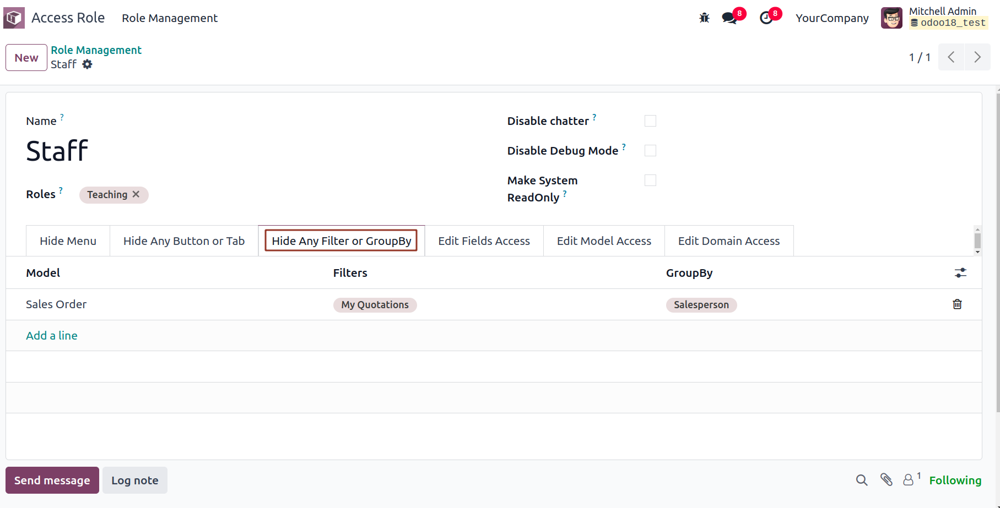
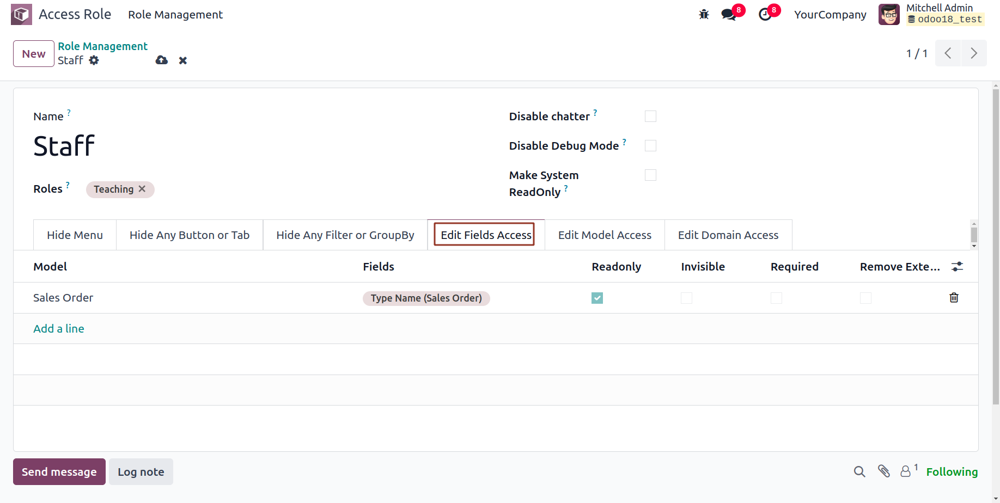
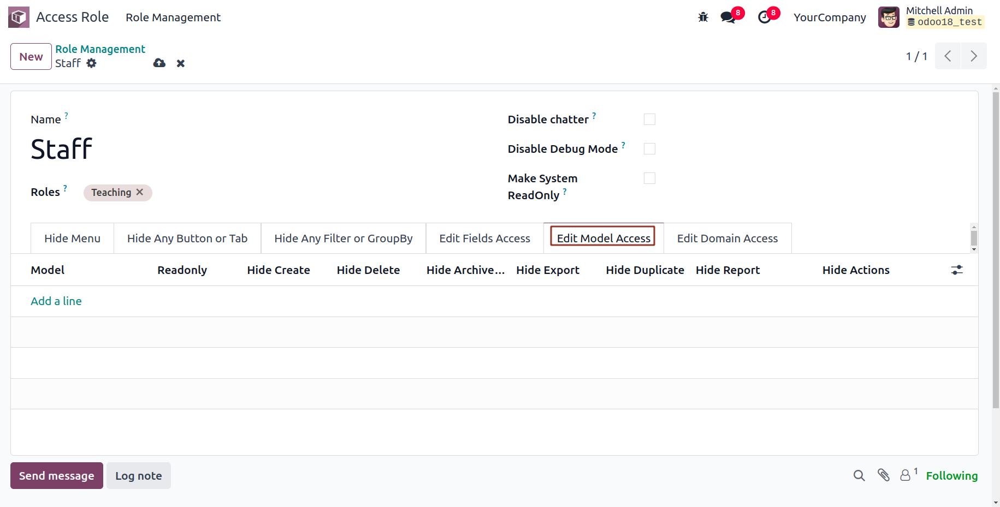
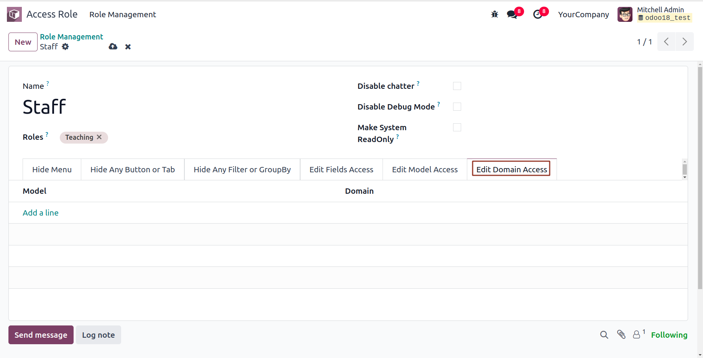
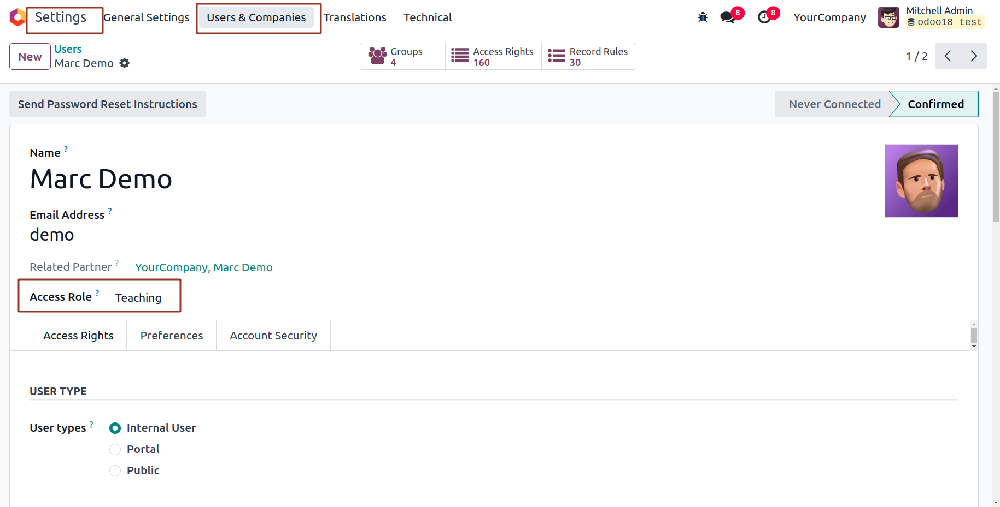

# Odoo Access Role

[](https://www.odoo.com)
[](https://opensource.org/licenses/MIT)
[](https://github.com/cybrosystech/Odoo-Access-Role)

## Overview

Odoo Access Role is an open-source module which enable access roles for users.

## Features

- 🔐 Easily assign predefined access rights using custom roles.  
 
- 🧩 Simplifies user access management by grouping permissions.  

- 🔄 Automatically updates views when roles or permissions change.  

- ✅ Ensures users get the correct permissions based on selected roles.
- 
## Screenshots

Here are some glimpses of Odoo Access Role in action:

### 1. Access Role

<div>
  <tr>
    <td align="center">
      
    </td>
  </tr>
</div>

### 2. Sales module

<div>
  <tr>
    <td align="center">
      
    </td>
  </tr>
</div>
<div>
  <tr>
    <td align="center">
      
    </td>
  </tr>
</div>
<div>
  <tr>
    <td align="center">
      
    </td>
  </tr>
</div>
<div>
  <tr>
    <td align="center">
      
    </td>
  </tr>
</div>
<div>
  <tr>
    <td align="center">
      
    </td>
  </tr>
</div>
<div>
  <tr>
    <td align="center">
      
    </td>
  </tr>
</div>
<div>
  <tr>
    <td align="center">
      
    </td>
  </tr>
</div>
<div>
  <tr>
    <td align="center">
      
    </td>
  </tr>
</div>


## Configuration

* No additional configurations needed.

## Installation

Follow these steps to set up and run the app:

1. **Clone the Repository**
   ```bash
   git clone https://github.com/cybrosystech/Odoo-Access-Role.git
   cd Odoo-Access-Role


## Contributing

We welcome contributions! Feel free to contribute and enhance the functionality. To get started:

1. Fork the repository.

2. Create a new branch:
   ```
   git checkout -b feature/your-feature-name
   ```
3. Make changes and commit:
   ```
   git commit -m "Add your message here"
   ```
4. Push your changes:
   ```
   git push origin feature/your-feature-name
   ```
5. Create a Pull Request on GitHub.

---
- Submit a pull request with a clear description of your changes.

## License

This project is licensed under the AGPL-3. Feel free to use, modify, and distribute it as needed.

## Contact

For questions or support, reach out to the maintainers at info@cybrosys.com or open an issue on GitHub.