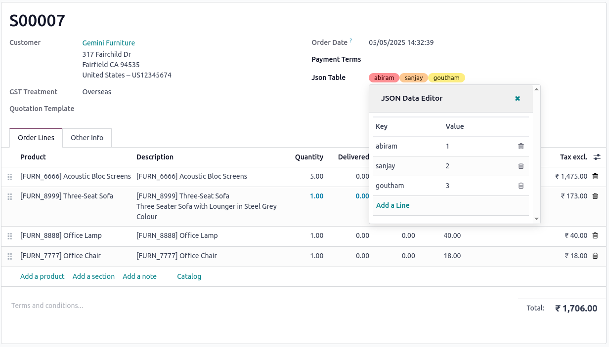

# Advanced JSON Widget for Odoo 18

[](https://www.odoo.com)
[](https://opensource.org/licenses/MIT)

An interactive and intuitive widget for managing JSON fields in Odoo 18, built using the modern OWL JavaScript framework.

## Overview

The Advanced JSON Widget is an Odoo module designed to simplify the management of JSON fields by providing an intuitive, interactive interface using OWL, allowing users to view, edit, and organize key-value data seamlessly within the Odoo backend.

## Features

- Features
- 🧩 **Interactive JSON Editor**: Easily add, edit, and delete key-value pairs with a user-friendly UI.
- ⚙️ **Seamless Odoo Integration**: Works effortlessly with Odoo 18 models using JSON fields.
- 🚀 **Modern OWL Framework**: Built with Odoo's OWL JavaScript framework for reactive and responsive behavior.
- 💾 **Structured Data Management**: Ensures clean and consistent JSON data storage within your records.
## Screenshots

Here are some glimpses of Json Widget:

### User Interface of WebView

<div>
  <tr>
    <td align="center">
      
    </td>
  </tr>
</div>


## Prerequisites

Before you begin, ensure you have the following installed:

- An active Odoo Community/Enterprise Edition instance (local or hosted)

## Installation

Follow these steps to set up and run the app:

1. **Clone the Repository**

   ```git clone https://github.com/cybrosystech/Json-Widget.git```
   
2. **Add the module to addons**

   ```cd Json-Widget```
## Usage

```
from odoo import fields, models

class SomeModel(models.Model):
    _name = 'some.model'

    json_data = fields.Json(string="JSON Data")
```
In the XML view, reference the widget like this:
```
<field name="json_data" widget="json_widget"/>
```

## Contributing

We welcome contributions! To get started:

1. Fork the repository.

2. Create a new branch:  
   ```  
   git checkout -b feature/your-feature-name  
   ```  
3. Make changes and commit:  
   ```  
   git commit -m "Add your message here"  
   ```  
4. Push your changes:  
   ```  
   git push origin feature/your-feature-name  
   ```  
5. Create a Pull Request on GitHub.  

---
- Submit a pull request with a clear description of your changes.

## License

This project is licensed under the LGPL-3. Feel free to use, modify, and distribute it as needed.

## Contact

* Mail Contact : odoo@cybrosys.com
* Website : https://cybrosys.com


Maintainer
==========

https://cybrosys.com

This module is maintained by Cybrosys Technologies.
For support and more information, please visit https://www.cybrosys.com