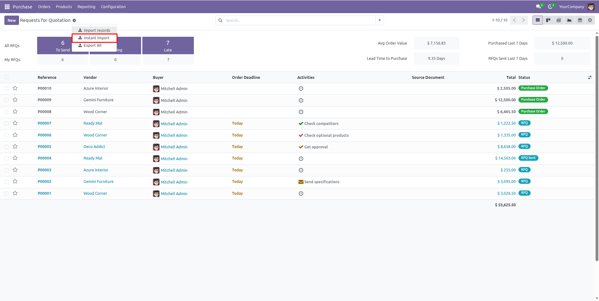
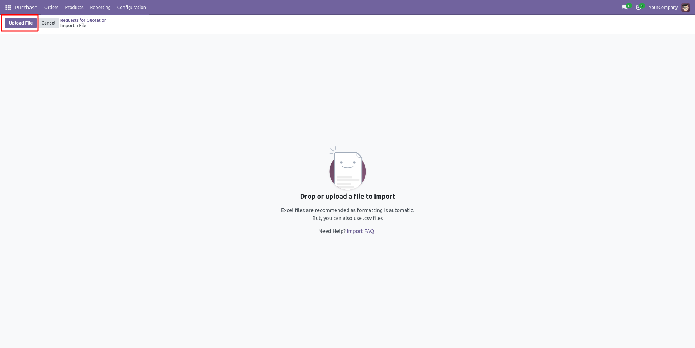
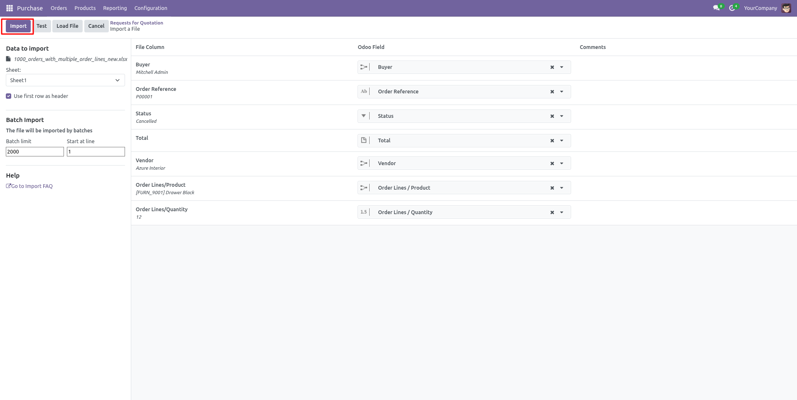
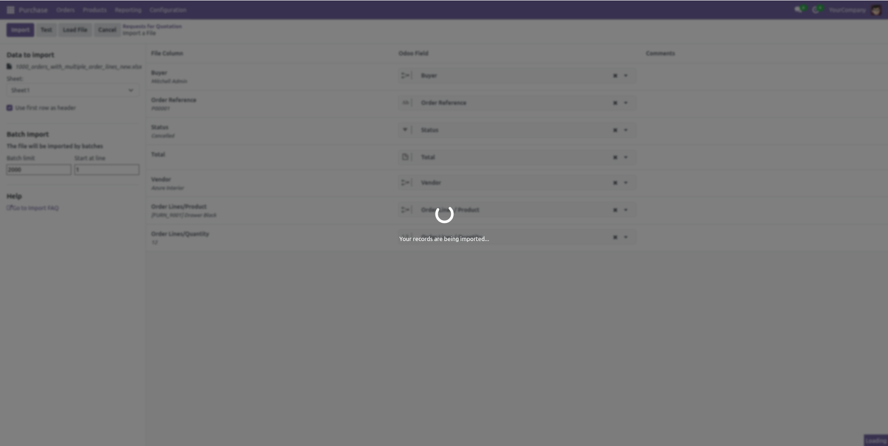
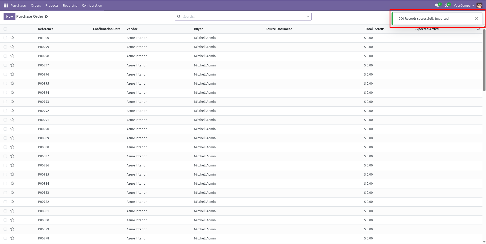

# Instant Import for Odoo 18

[](https://www.odoo.com)
[](https://opensource.org/licenses/MIT)


## Overview

The Instant Import module is an Odoo extension that streamlines the data import
process by providing a user-friendly interface built with OWL. It lets users 
test and import Excel data into any model with validation, error feedback, and
smooth record creation. Designed for performance, the module ensures that large
volumes of data are imported quickly and efficiently.

## Features

- **Fast Data Import**: Quickly import large volumes of records from Excel files into any Odoo model.
- **Real-Time Validation**: Instantly checks for field mismatches or errors before importing.
- **OWL-Based Interface**: Modern and responsive UI built with Odoo Web Library (OWL) for smooth user experience.
- **Seamless Record Creation**: Automatically creates records without navigating away from the current view.
## Screenshots

Here are some glimpses of Odoo Instant Import:

### Purchase module

<div>
  <tr>
    <td align="center">
      
    </td>
  </tr>
</div>
<div>
  <tr>
    <td align="center">
      
    </td>
  </tr>
</div>
<div>
  <tr>
    <td align="center">
      
    </td>
  </tr>
</div>
<div>
  <tr>
    <td align="center">
      
    </td>
  </tr>
</div>
<div>
  <tr>
    <td align="center">
      
    </td>
  </tr>
</div>
<div>
  <tr>
    <td align="center">
      
    </td>
  </tr>
</div>

## Prerequisites

Before you begin, ensure you have the following installed:

- An active Odoo Community/Enterprise Edition instance (local or hosted)

## Installation

Follow these steps to set up and run the app:

1. **Clone the Repository**

   ```git clone https://github.com/cybrosystech/Instant-Import.git```
   
2. **Add the module to addons**

   ```cd Instant-Import```

## Contributing

The feature - The ability to update existing records during import is not yet implemented.
Currently, the importer supports only the creation of new records.
Updates to existing entries will be available in a future release.
We welcome contributions! To get started:

1. Fork the repository.

2. Create a new branch:  
   ```  
   git checkout -b feature/your-feature-name  
   ```  
3. Make changes and commit:  
   ```  
   git commit -m "Add your message here"  
   ```  
4. Push your changes:  
   ```  
   git push origin feature/your-feature-name  
   ```  
5. Create a Pull Request on GitHub.  

---
- Submit a pull request with a clear description of your changes.

## License

This project is licensed under the LGPL-3. Feel free to use, modify, and distribute it as needed.

Company
-------
* `Cybrosys Techno Solutions <https://cybrosys.com/>`

## Contact

* Mail Contact : odoo@cybrosys.com
* Website : https://cybrosys.com

Maintainer
==========
.. image:: https://cybrosys.com/images/logo.png
   :target: https://cybrosys.com

This module is maintained by Cybrosys Technologies.
For support and more information, please visit https://www.cybrosys.com
