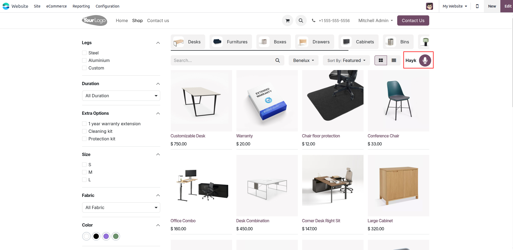
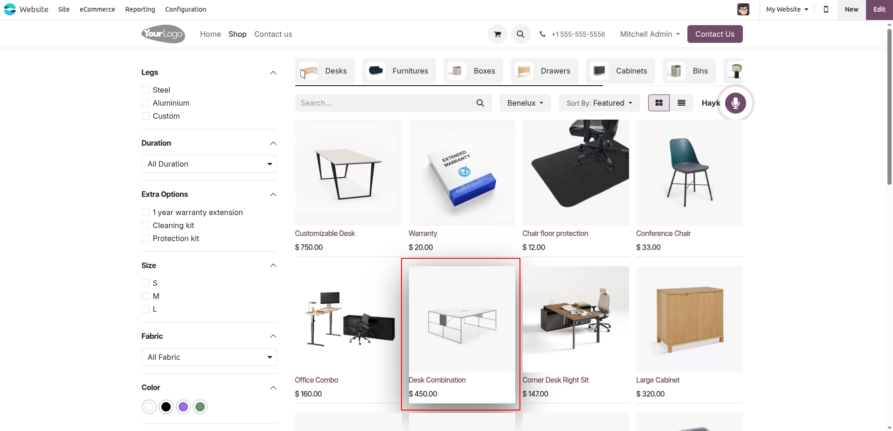
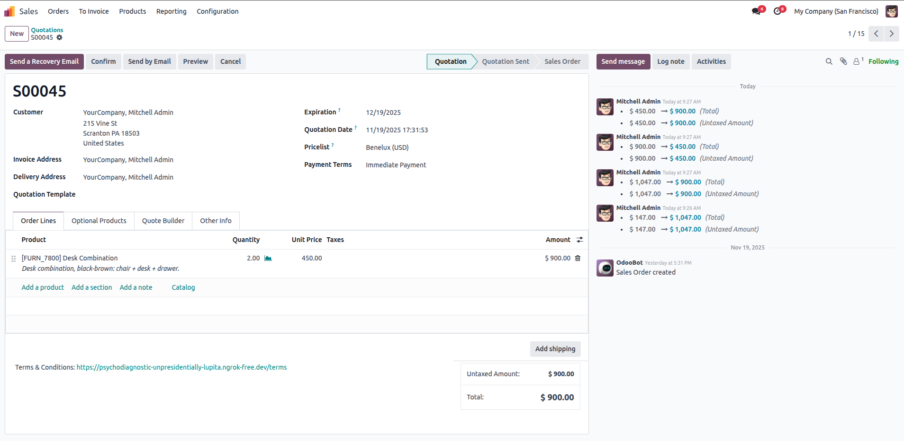

# Ora-Ai Website for Odoo 18

[](https://www.odoo.com)
[](https://opensource.org/licenses/MIT)

## Overview

This module facilitates order placement via ora AI voice assistance,
seamlessly integrating with the Sale Order system to enhance customer service and streamline operations.

## Features

- ⏱️**Reducing Order Time.**
- 🎙️**Replacing Employees with Voice Assistance.**
- 🕒**24/7 Availability.**
- 🛒**Automated Sale Order Creation.**
- 🌐**Starts in English, then auto-detects and switches
  to your default language set in the voice assistant.**
- 🧅**Addon Product Options and Variants.**
- 📢**Promotional Content Integration.**

## Screenshots

Here are some glimpses of ORA AI:

### VAPI AI Interface

<div>
  <tr>
    <td align="center">
      
    </td>
  </tr>
</div>

### Voice Assistance Interface

<div>
  <tr>
    <td align="center">
        Clicking the icon allows us to communicate with the assistants directly from the website.     
        
    </td>
  </tr>
</div>
<div>
  <tr>
    <td align="center"> Once you’ve selected the product and quantity, just confirm the order to add it to
                                    your cart.
      
    </td>
  </tr>
</div>
<div>
  <tr>
    <td align="center">The corresponding sales order has been created. We can now proceed with the
                                    remaining confirmation steps.
      
    </td>
  </tr>
</div>

## Prerequisites

Before you begin, ensure you have the following installed:

- An active Odoo Community/Enterprise Edition instance (local or hosted)

## Configuration

- Once installed, users will be able to add the API details for VAPI AI.
  Company

## Installation

Follow these steps to set up and run the app:

1. **Clone the Repository**

   ```git clone https://github.com/cybrosystech/Ora-AI-Voice.git```

2. **Add the module to addons**

   ```cd Ora AI```

## Contributing

We welcome contributions! To get started:

1. Fork the repository.

2. Create a new branch:
   ```  
   git checkout -b feature/your-feature-name  
   ```  
3. Make changes and commit:
   ```  
   git commit -m "Add your message here"  
   ```  
4. Push your changes:
   ```  
   git push origin feature/your-feature-name  
   ```  
5. Create a Pull Request on GitHub.

---

- Submit a pull request with a clear description of your changes.

## License

This project is licensed under the AGPL-3. Feel free to use, modify, and distribute it as needed.

Company
-------

* `Cybrosys Techno Solutions <https://cybrosys.com/>`

## Contact

* Mail Contact : odoo@cybrosys.com
* Website : https://cybrosys.com


Maintainer
==========

https://cybrosys.com


This module is maintained by Cybrosys Technologies.
For support and more information, please visit https://www.cybrosys.com