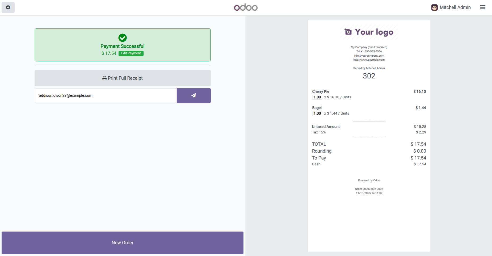
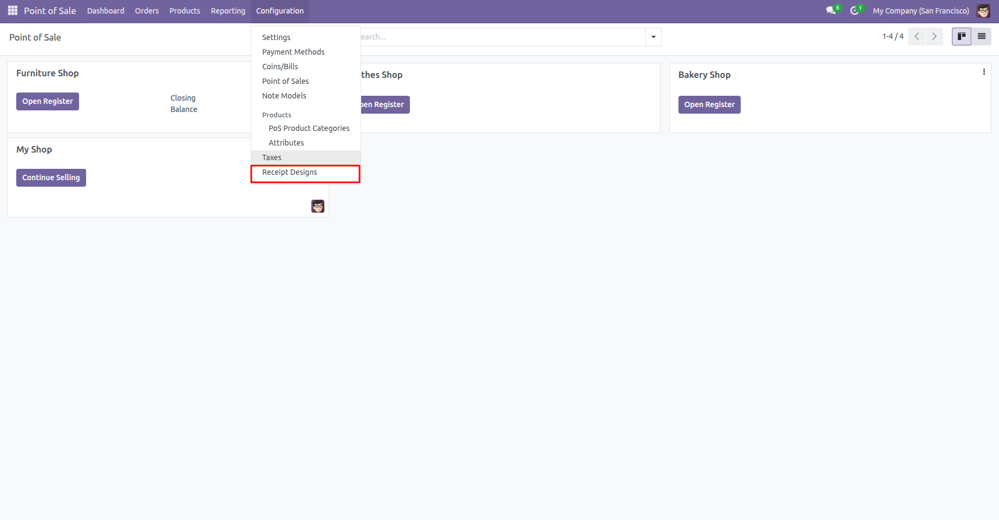
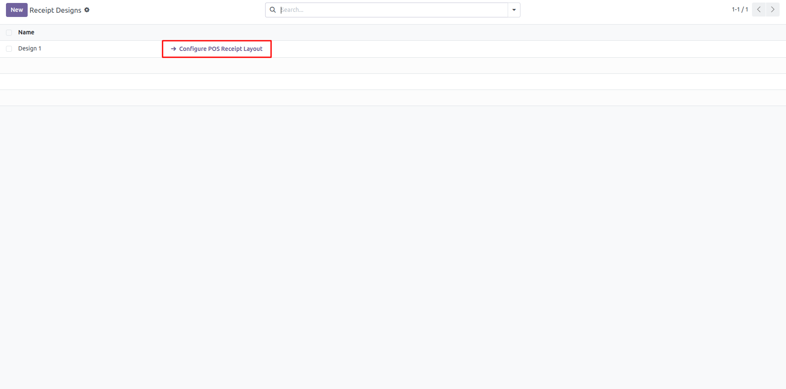
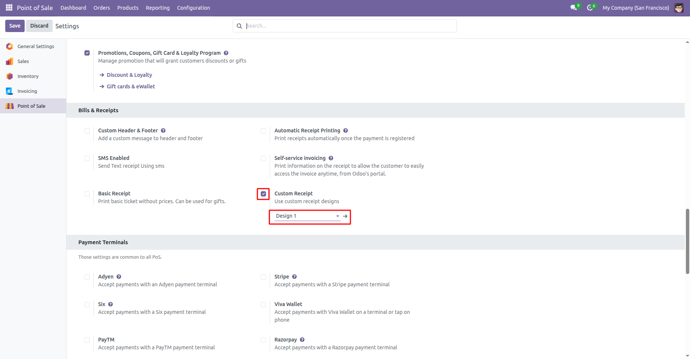
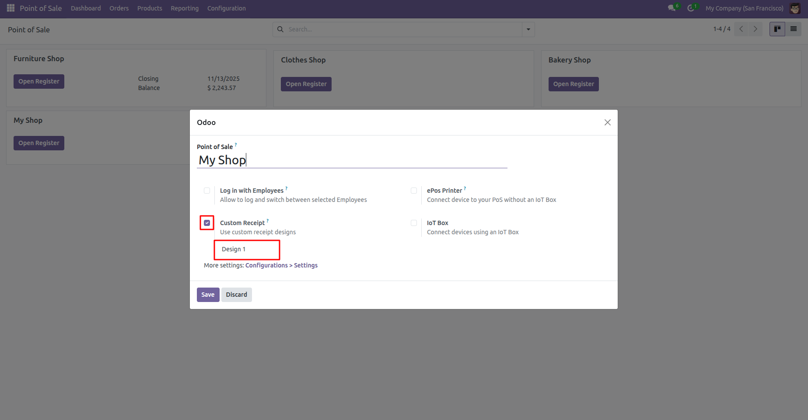
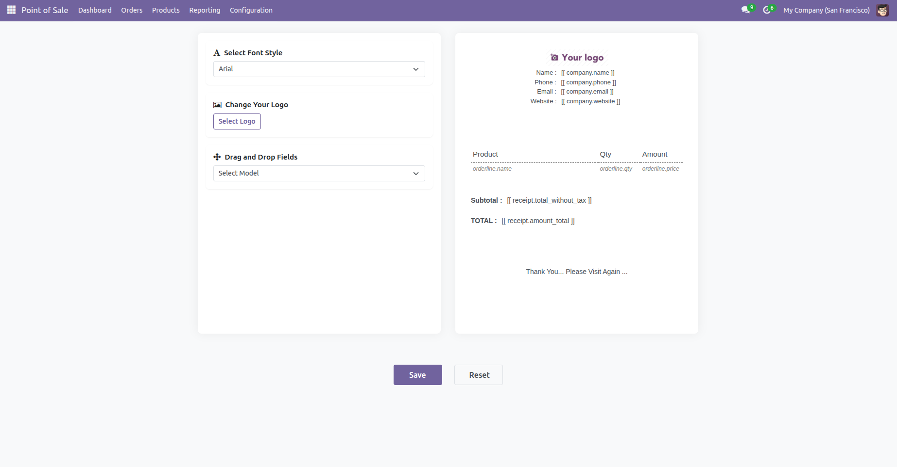
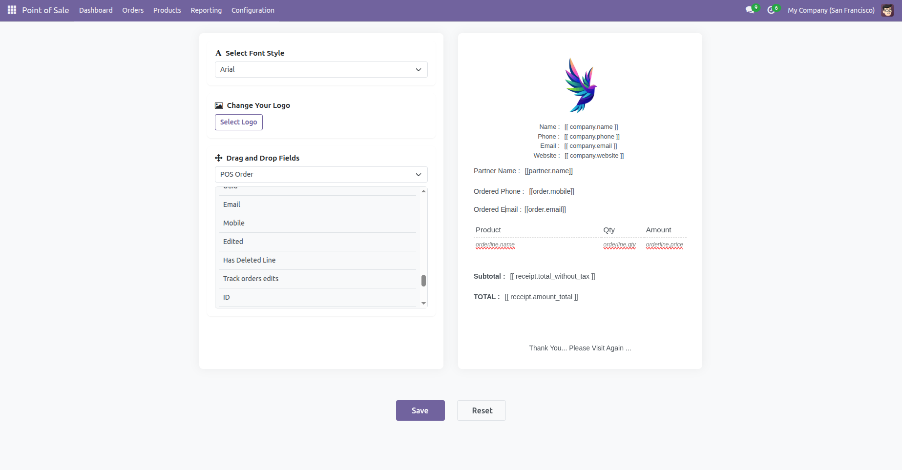
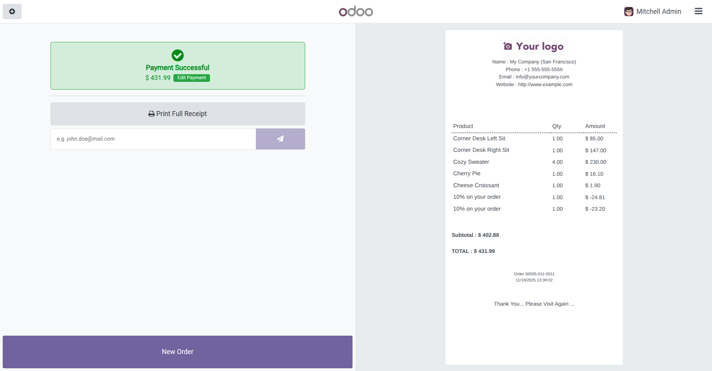
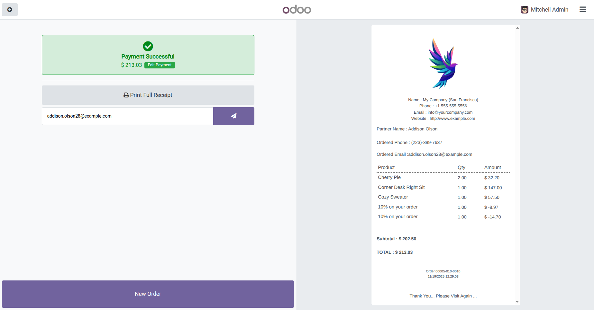

# POS Receipt UI Customizer for Odoo 18

[](https://www.odoo.com)
[](https://opensource.org/licenses/MIT)

## Overview

Option to customise POS Receipts through UI

## Features

- 🧾**Adding of Receipt Design.**
- 🎛️️**Choosing for Current Receipt Design.**
- 🌐**Choosing of Receipt in Frontend.**
- ✏️**Editing of Receipt Design.**


## Screenshots

Here are some glimpses of POS Receipt UI Customizer:

### Default Receipt of POS.

<div>
  <tr>
    <td align="center">
      
    </td>
  </tr>
</div>

### Receipt Designs

<div>
  <tr>
    <td align="center">
      
    </td>
  </tr>
</div>
<div>
  <tr>
    <td align="center">
      
    </td>
  </tr>
</div>

### Choose receipt design for POS.
<div>
  <tr>
    <td align="center">
        
    </td>
  </tr>
</div>
<div>
  <tr>
    <td align="center">
        
    </td>
  </tr>
</div>

###  Edit receipt designs for POS.
<div>
  <tr>
    <td align="center">
      
    </td>
  </tr>
</div>
<div>
  <tr>
    <td align="center">
      
    </td>
  </tr>
</div>

### Chosen receipt in the frontend

<div>
  <tr>
    <td align="center">
      
    </td>
  </tr>
</div>
<div>
  <tr>
    <td align="center">
      
    </td>
  </tr>
</div>

## Prerequisites

Before you begin, ensure you have the following installed:

- An active Odoo Community/Enterprise Edition instance (local or hosted)

## Configuration

* No additional configurations needed.

## Contributing

We welcome contributions! To get started:

1. Fork the repository.

2. Create a new branch:
   ```  
   git checkout -b feature/your-feature-name  
   ```  
3. Make changes and commit:
   ```  
   git commit -m "Add your message here"  
   ```  
4. Push your changes:
   ```  
   git push origin feature/your-feature-name  
   ```  
5. Create a Pull Request on GitHub.

---

- Submit a pull request with a clear description of your changes.

## License

This project is licensed under the AGPL-3. Feel free to use, modify, and distribute it as needed.

Company
-------
* `Cybrosys Techno Solutions <https://cybrosys.com/>`

## Contact

* Mail Contact : odoo@cybrosys.com
* Website : https://cybrosys.com


Maintainer
==========

https://cybrosys.com

This module is maintained by Cybrosys Technologies.
For support and more information, please visit https://www.cybrosys.com