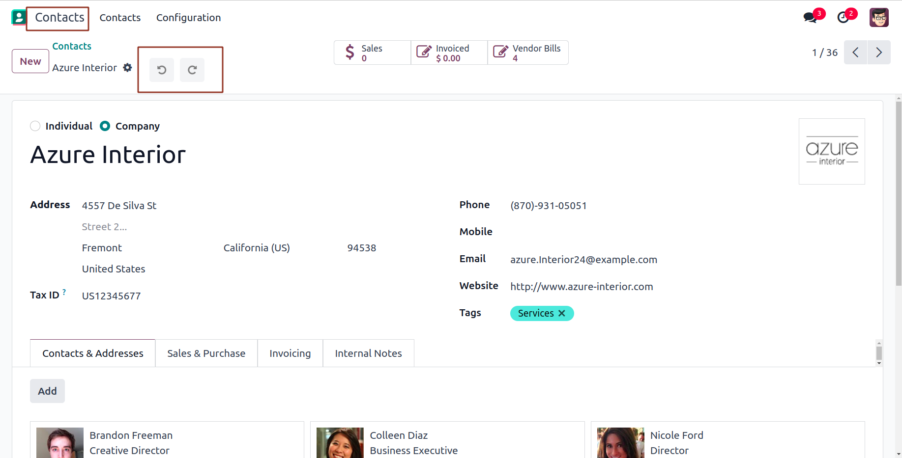
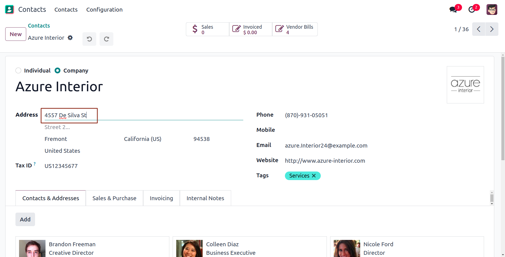
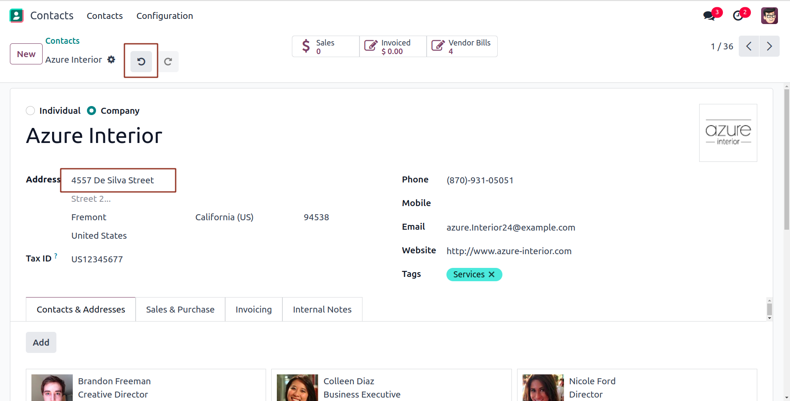
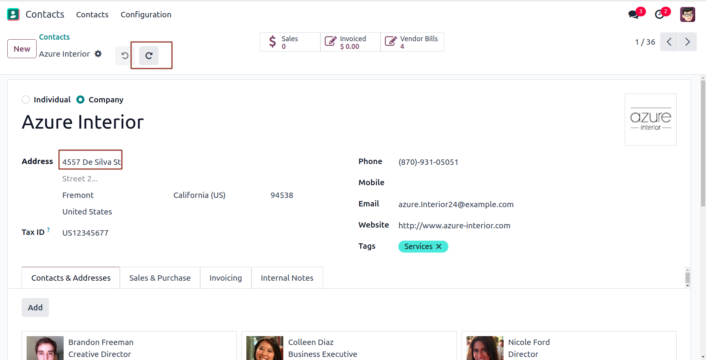
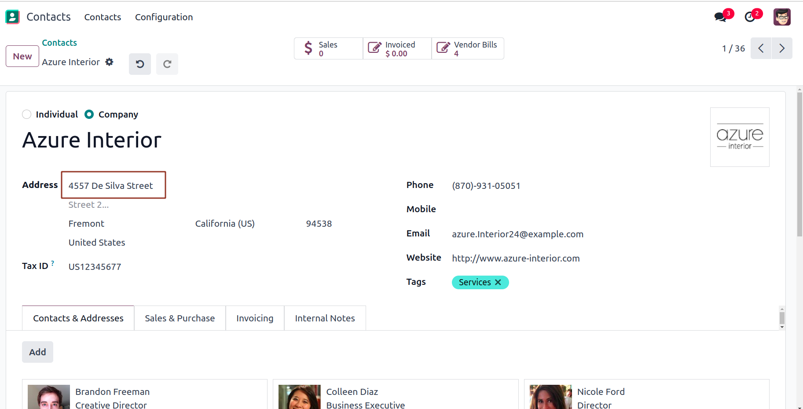
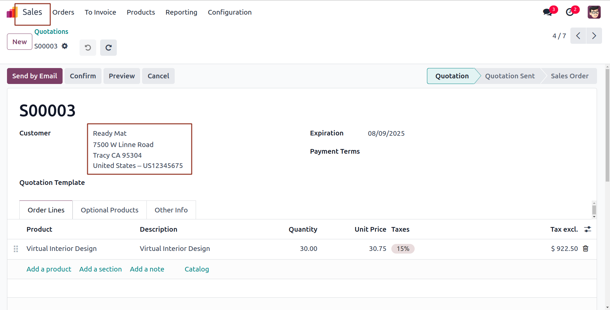
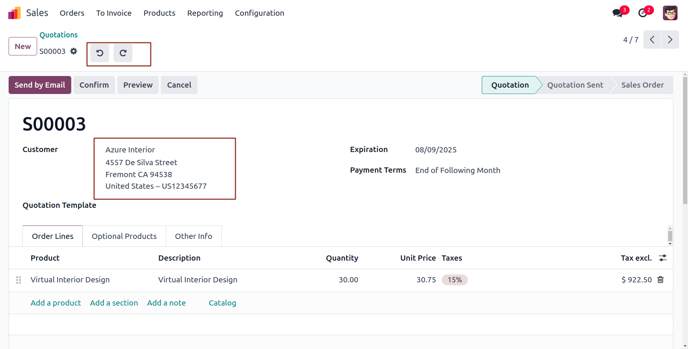
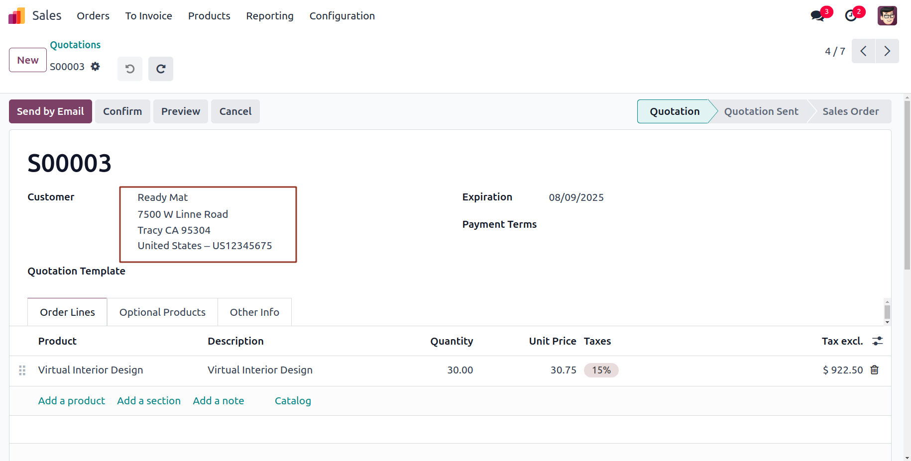

# Odoo Undo Redo

[](https://www.odoo.com)
[](https://opensource.org/licenses/MIT)
[]

## Overview

Odoo Undo Redo is an open-source module which enables Undo/Redo globally across Odoo.


## Features

- 🌐 **Track and Revert Changes made to Records Automatically using PostgreSQL Triggers.
- 📏 **Undo and Redo Operations Available Instantly From the Form View.

## Screenshots

Here are some glimpses of Odoo Undo Redo in action:

### 1. Contacts module

<div>
  <tr>
    <td align="center">
      
    </td>
  </tr>
</div>
<div>
  <tr>
    <td align="center">
      
    </td>
  </tr>
</div>
<div>
  <tr>
    <td align="center">
      
    </td>
  </tr>
</div>
<div>
  <tr>
    <td align="center">
      
    </td>
  </tr>
</div>
<div>
  <tr>
    <td align="center">
      
    </td>
  </tr>
</div>

### 2. Sales module

<div>
  <tr>
    <td align="center">
      
    </td>
  </tr>
</div>
<div>
  <tr>
    <td align="center">
      
    </td>
  </tr>
</div>
<div>
  <tr>
    <td align="center">
      
    </td>
  </tr>
</div>

## Configuration

* No additional configurations needed.

## Installation

Follow these steps to set up and run the app:

1. **Clone the Repository**
   ```bash
   git clone https://github.com/cybrosystech/Odoo-Undo-Redo.git
   cd Odoo-Undo-Redo

## Contributing

We welcome contributions! Undo and Redo for one2many records is in progress.
If you're interested, feel free to contribute and enhance this functionality. To get started:

1. Fork the repository.

2. Create a new branch:
   ```
   git checkout -b feature/your-feature-name
   ```
3. Make changes and commit:
   ```
   git commit -m "Add your message here"
   ```
4. Push your changes:
   ```
   git push origin feature/your-feature-name
   ```
5. Create a Pull Request on GitHub.

---
- Submit a pull request with a clear description of your changes.

## License

This project is licensed under the AGPL-3. Feel free to use, modify, and distribute it as needed.

Company
-------
* `Cybrosys Techno Solutions <https://cybrosys.com/>`

## Contact

* Mail Contact : odoo@cybrosys.com
* Website : https://cybrosys.com


Maintainer
==========

https://cybrosys.com


This module is maintained by Cybrosys Technologies.
For support and more information, please visit https://www.cybrosys.com